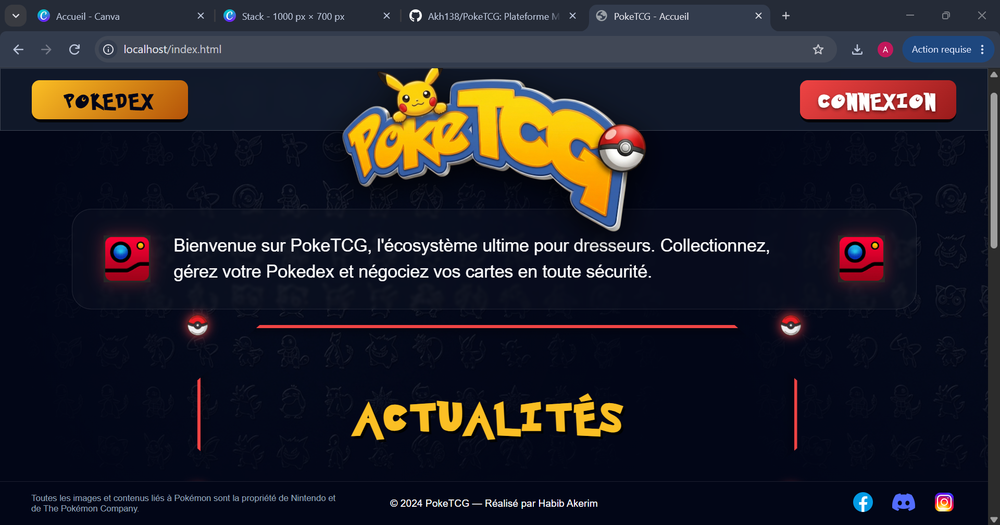
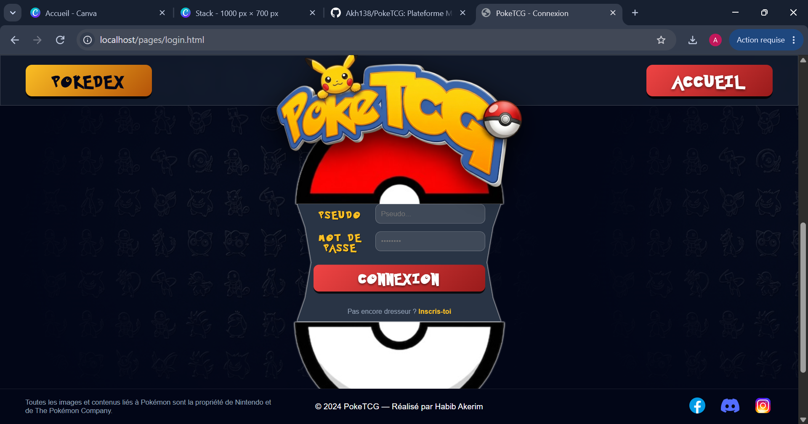
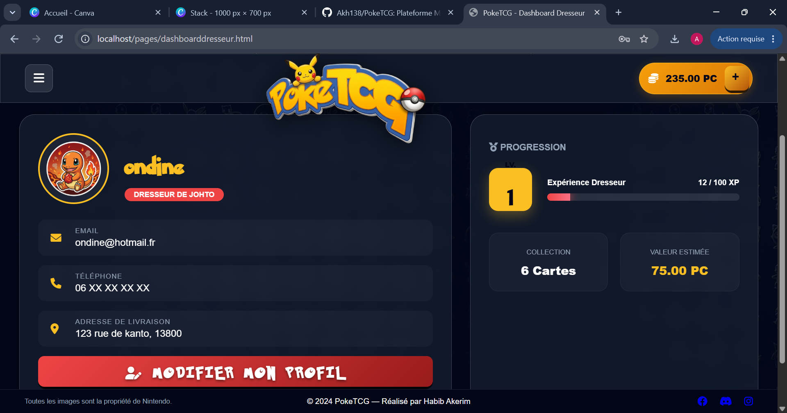
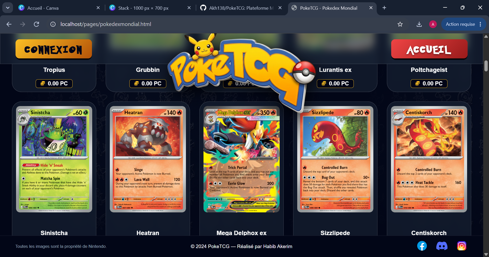
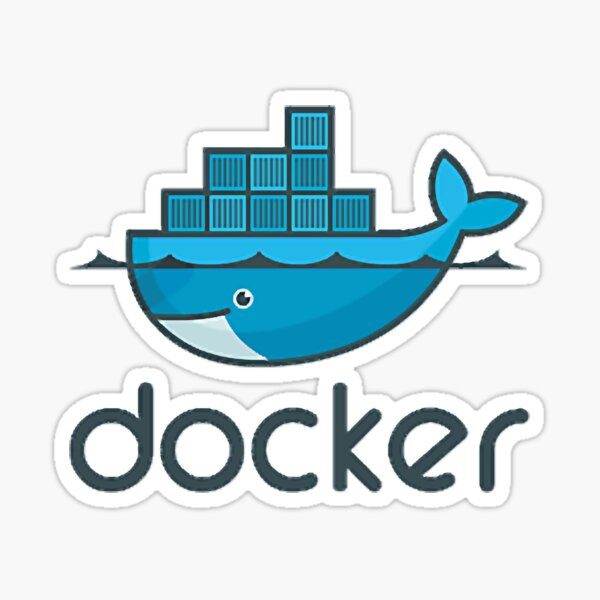
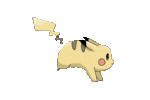

<p align="center">
   
</p>

<p align="center">
  <b>Une plateforme robuste de trading de cartes Pokémon, conçue avec une architecture distribuée en Microservices pour garantir scalabilité et sécurité.</b>
</p>

---

##  Architecture Technique

> Le projet repose sur une approche **Microservices** pour une maintenance et une évolution facilitées. Chaque service est indépendant et communique via une passerelle API.
>
> * **Backend :** Java 17, Spring Boot 3.x, Spring Cloud.
> * **Communication :** REST API, Spring Cloud OpenFeign.
> * **Persistance Polyglotte :**
    >   * MySQL (Transactions financières & Utilisateurs).
>   * MongoDB (Catalogue & Social).
> * **Déploiement :** Docker & Docker Compose.

---

##  Services Principaux

> * `identity-service` : Authentification sécurisée (JWT, Spring Security).
> * `catalog-service` : Agrégation d'APIs tierces (TCGdex & pokemontcg.io) avec mise en cache.
> * `inventory-service` : Gestion du Pokedex personnel et état des cartes.
> * `marketplace-service` : Workflow de transactions sécurisé (Escrow) et gestion des annonces.
> * `wallet-service` : Gestion du solde et historique transactionnel.

---

---

## 📸 Aperçu de l'Application

| Accueil | Inscription |
| :---: | :---: |
|  |  |

|                         Dashboard Dresseur                         | Catalogue Pokedex |
|:------------------------------------------------------------------:| :---: |
|  |  |

---
##  Installation & Lancement

Le projet étant basé sur une architecture **Microservices**, j'utilise **Docker Compose** pour orchestrer l'ensemble de l'écosystème.

### Prérequis
- [Docker Desktop](https://www.docker.com/products/docker-desktop/) installé et lancé.
- Java 17 et Maven installés.

### Lancement
1. **Cloner le projet :**
   ```bash
   git clone https://github.com/Akh138/PokeTCG-Project.git
---
##  Stack Technique

> * **Développement :**
    >   
    >   

>
> * **Outils & Environnement :**
    >   
    >   
    >   

---

##  Sécurité & Intégrité

> * **Authentification :** Gestion des rôles (Dresseur/Manager/Admin) via **JWT (JSON Web Token)**.
> * **Protection :** Hachage des mots de passe avec **BCrypt**.
> * **Transactions :** Utilisation de transactions SQL atomiques pour garantir l'intégrité financière.
> * **Validation :** Validation des données côté serveur avec `Spring Boot Validation`.

---

##  Objectif

> Créer un écosystème numérique sécurisé pour les collectionneurs, alliant la passion de la collection à la rigueur d'une plateforme de type Fintech.

<p align="center">
  
  

</p>